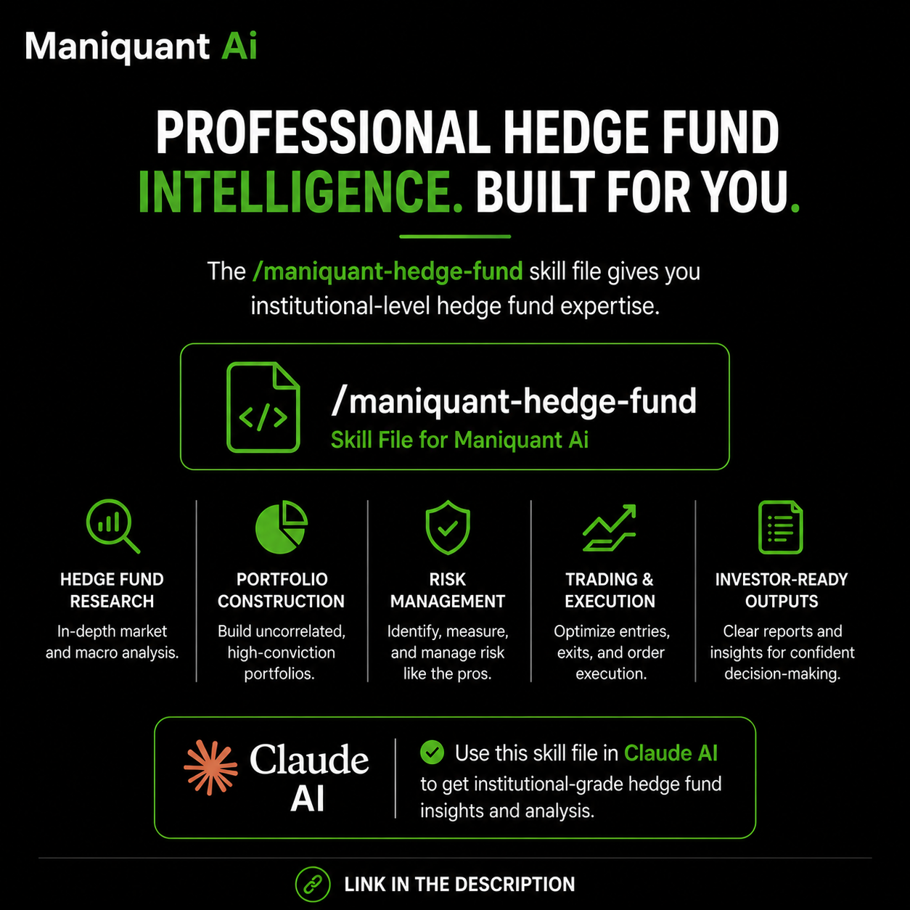

# ManiQuant AI — Hedge Fund Research Agent

**Professional hedge fund intelligence. Built for you.**

`/maniquant-hedge-fund` is a Claude skill file that gives Claude institutional-level hedge fund expertise for Indian equity markets (NSE/BSE).

## What This Skill Does

ManiQuant AI turns Claude into an elite hedge fund research agent operating with institutional-grade depth, real-time data, and a multi-agent reasoning framework — delivering structured, actionable research instead of generic summaries.

| Capability | Description |
|---|---|
| 🔍 **Hedge Fund Research** | In-depth market and macro analysis |
| 🥧 **Portfolio Construction** | Build uncorrelated, high-conviction portfolios |
| 🛡️ **Risk Management** | Identify, measure, and manage risk like the pros |
| 📈 **Trading & Execution** | Optimize entries, exits, and order execution |
| 📋 **Investor-Ready Outputs** | Clear reports and insights for confident decision-making |

## Key Triggers

This skill activates on queries such as:
- "research [stock]" / "analyze [company]"
- "backtest [strategy]" / "is this strategy profitable"
- "momentum strategy" / "mean reversion"
- "show portfolio dashboard" / "deep analysis" / "live analysis"
- "should I enter this trade" / "hedge fund report"
- Any Nifty 50, Bank Nifty, F&O, FII/DII, or broader Indian macro query

## Live Data Mandate

The skill enforces a **zero-tolerance policy on stale or assumed data**. Before producing any number (price, index level, exchange rate, fundamentals, technicals), Claude must web search for it — never rely on training knowledge. All figures are timestamped and sourced.

## Output Format

All outputs render as interactive, dark-themed HTML dashboards (via `show_widget`) styled with the ManiQuant design system (Share Tech Mono / Rajdhani fonts, signature green-on-black palette) and include Chart.js donut/pie visualizations for score composition, shareholder structure, portfolio allocation, sector sentiment, and more.

## Usage

1. Place the skill file at `/mnt/skills/user/maniquant-hedge-fund/SKILL.md` (or your configured skills directory).
2. In Claude AI, ask a relevant query (e.g., "analyze RELIANCE" or "how is the market today").
3. Claude automatically detects the trigger and applies the ManiQuant AI skill to generate an institutional-grade research report.

---

*Built for the Indian equity markets ecosystem — NSE / BSE.*
